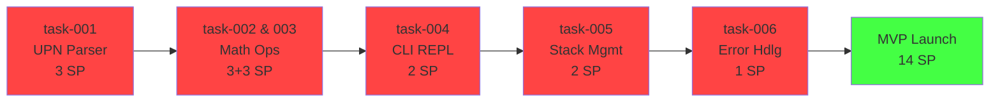

# UPN-Taschenrechner CLI - Projektplan

**Status**: 🟡 Ready for Development
**Erstellt**: 28. November 2025
**Ziel-Release**: 23. Dezember 2025

---

## 📋 Projektübersicht

Strukturierter Entwicklungsplan für den **UPN-Taschenrechner CLI**, bestehend aus:

- **EPIC.md** - Feature-Übersicht, Business Value, Timeline
- **STATUS.md** - Projekt-Status, Dependencies, Fortschritt
- **tasks/** - Detaillierte Task-Beschreibungen (11 Tasks)

**Gesamter Story Points**: 21 SP (14 SP Must-Have)

---

## 📂 Dateistruktur

```
.plans/upn-taschenrechner-cli/
├── EPIC.md                                    # Feature-Übersicht
├── STATUS.md                                  # Progress & Dependencies
├── README.md                                  # Diese Datei
└── tasks/
    ├── task-001-upn-parser-core.md           # 3 SP | UPN-Parser Foundation
    ├── task-002-grundoperationen.md          # 3 SP | +, -, *, /
    ├── task-003-trigonometrische-funktionen.md # 3 SP | sin, cos, tan
    ├── task-004-cli-repl.md                  # 2 SP | Interaktive Shell
    ├── task-005-stack-management.md          # 2 SP | Stack-Display & Clear
    ├── task-006-error-handling.md            # 1 SP | Fehlerbehandlung
    ├── task-007-help-system.md               # 2 SP | Help & Docs
    ├── task-008-error-messages.md            # 1 SP | Error-Message Enhancement
    ├── task-009-precision-tests.md           # 1 SP | Precision Validation
    ├── task-010-command-history.md           # 2 SP | Arrow-Keys History
    └── task-011-memory-functions.md          # 1 SP | M+, M-, MR, MC
```

---

## 🚀 Quick Start für Entwickler

### 1. PRD verstehen
Lese das vollständige **PRD.md** im Root-Verzeichnis

### 2. Projekt-Übersicht
Starte mit **EPIC.md** für Business Value und Timeline

### 3. Aktuellen Status prüfen
Schaue **STATUS.md** für Dependencies und Critical Path

### 4. Task starten
Wähle einen Task aus `tasks/` und folge der Beschreibung

### Empfohlene Reihenfolge (Critical Path)

```
1. task-001 (UPN Parser)           3 SP
   ↓
2. task-002 & 003 (Math Ops)       3 + 3 SP [Parallel möglich]
   ↓
3. task-004 (CLI REPL)             2 SP
   ↓
4. task-005 (Stack Management)     2 SP
   ↓
5. task-006 (Error Handling)       1 SP
   ↓
6. task-007 (Help System)          2 SP
   ↓
MVP-Launch ✅ (14 SP)
```

---

## 📊 Tasks-Übersicht

### Must-Have (MVP - 14 SP)

| ID | Task | SP | Status | Agents |
|----|------|----|----|--------|
| 001 | UPN-Parser Core | 3 | 🔴 pending | `python-expert` |
| 002 | Grundoperationen | 3 | 🔴 pending | `python-expert` |
| 003 | Trigonometrische Fn | 3 | 🔴 pending | `python-expert` |
| 004 | CLI REPL | 2 | 🔴 pending | `python-expert` |
| 005 | Stack Management | 2 | 🔴 pending | `python-expert` |
| 006 | Error Handling | 1 | 🔴 pending | `python-expert` |

**MVP Total**: 14 SP (2-3 Wochen @ 1 Senior Dev)

### Should-Have (Post-MVP, Sprint 3 - 4 SP)

| ID | Task | SP | Status | Agents |
|----|------|----|----|--------|
| 007 | Help System | 2 | 🔴 pending | `markdown-syntax-formatter` |
| 008 | Error Messages Enhancement | 1 | 🔴 pending | `python-expert` |
| 009 | Precision Tests | 1 | 🔴 pending | `python-expert` |

### Could-Have (Backlog - 3 SP)

| ID | Task | SP | Status | Agents |
|----|------|----|----|--------|
| 010 | Command History | 2 | 🔴 pending | `python-expert` |
| 011 | Memory Functions | 1 | 🔴 pending | `python-expert` |

---

## 🎯 Milestones

| Milestone | Date | Description |
|-----------|------|-------------|
| **M1** | 30. Nov | Design & Planning Approval |
| **M2** | 9. Dez | Core Implementation (task-001,002,003) |
| **M3** | 13. Dez | Trig Functions Complete |
| **M4** | 20. Dez | CLI & Testing Complete |
| **M5** | 22. Dez | Documentation & Polish |
| **M6** | 23. Dez | **Launch v1.0** 🚀 |

---

## 📈 Critical Path



**Duration**: ~11 SP Critical Path (9 SP mit Parallelisierung)

---

## 🔄 Dependencies Graph

```
task-001 (UPN Parser)
├── task-002 (Grundoperationen)
├── task-003 (Trigonometrische Funktionen)
├── task-004 (CLI REPL) ← depends on all above
│   ├── task-005 (Stack Management)
│   └── task-006 (Error Handling)
│       ├── task-007 (Help System)
│       ├── task-008 (Error Messages)
│       └── task-009 (Precision Tests)

task-010 & 011 (Backlog) ← nach MVP evaluieren
```

---

## 📝 Task-Details Pro Datei

Jede Task-Datei enthält:

- **Metadata**: ID, Status, Priority, Story Points
- **Description**: Was wird gebaut, warum, User Story
- **Acceptance Criteria**: Klare, testbare Kriterien
- **Dependencies**: Was wird vorausgesetzt, was blockiert
- **Agent Recommendation**: Empfohlener KI-Agent
- **Implementation Notes**: Technische Details, Code-Beispiele
- **Testing Strategy**: Unit Tests, Integration Tests, Edge Cases
- **Notes**: PRD-Referenzen, Challenges, Future Enhancements

---

## 🏗️ Projektstruktur (Implementierung)

```
upn_calculator/
├── __init__.py
├── __main__.py           # CLI Entry Point
├── calculator.py         # Main UPNCalculator class
├── parser.py            # Tokenize & Parsing
├── operators.py         # +, -, *, / Operationen
├── math_functions.py    # sin, cos, tan Funktionen
├── cli.py               # REPL Loop
├── errors.py            # Custom Exceptions
└── tests/
    ├── __init__.py
    ├── test_calculator.py
    ├── test_operators.py
    ├── test_math_functions.py
    ├── test_stack_management.py
    ├── test_error_handling.py
    └── test_cli.py
```

---

## ✅ Qualitäts-Checkpoints

### Für jeden Task

- [ ] Unit Tests geschrieben (≥ 80% Coverage)
- [ ] Code Review durchgeführt
- [ ] Keine Pylint Warnungen
- [ ] Docstrings vollständig
- [ ] Edge Cases getestet
- [ ] Error Cases getestet

### Vor Launch

- [ ] Alle Must-Have Tasks fertig
- [ ] Gesamter Test Coverage ≥ 80%
- [ ] README dokumentiert
- [ ] Manual QA durchgeführt
- [ ] Performance Tests bestanden (< 100ms)

---

## 🔍 Wie man einen Task durchführt

1. **Aufgabe verstehen**: Lese die Task-Datei komplett
2. **Dependencies prüfen**: Sind alle voraus-Tasks fertig?
3. **Code schreiben**: Folge den Implementation Notes
4. **Tests schreiben**: TDD - Tests VOR Implementation
5. **Review anfordern**: Peer-Code-Review
6. **Merge**: Nach Review und Tests grünes Licht
7. **Statusupdate**: STATUS.md aktualisieren

---

## 📞 Kontakt & Fragen

**Fragen zur Planung?** → Konsultiere EPIC.md oder STATUS.md
**Fragen zum Task?** → Schaue in die jeweilige task-*.md Datei
**Technische Fragen?** → Siehe Implementation Notes im Task
**PRD Details?** → Lies die entsprechende PRD.md Sektion

---

## 📚 Verwandte Dokumente

- **PRD.md** - Vollständiges Product Requirements Document
- **EPIC.md** - Feature-Übersicht und Business Value
- **STATUS.md** - Aktueller Projekt-Status
- **README.md** (Root) - Projekt-Übersicht

---

## 🎓 Lessons Learned & Conventions

### Development Conventions

- **Language**: Python 3.13.1+
- **Testing**: pytest
- **Code Style**: PEP 8 (Pylint)
- **Documentation**: Google-style Docstrings
- **Error Handling**: Custom Exception Hierarchy

### Git Conventions

- Branch per Task: `task/001-upn-parser-core`
- Commit Messages: Emoji + Deutsche Beschreibung
- PR-Review: Peer-Review vor Merge

### Communication

- Status-Updates: Wöchentlich
- Risk-Reassessment: Jeden Sprint
- Team Sync: Wenn Blocker auftauchen

---

**Last Updated**: 28. November 2025
**Next Review**: 30. November 2025 (nach Stakeholder Approval)

🚀 **Ready to Build!**
