# Project Status: UPN-Taschenrechner CLI

**Last Updated**: 28. November 2025, 10:30 CET

## Progress Overview

- **Total Tasks**: 11 (Initial MVP-Tasks)
- **Completed**: 0 (0%)
- **In Progress**: 0 (0%)
- **Pending**: 11 (100%)
- **Blocked**: 0 (0%)

**Total Story Points**: 21 SP
- **Must-Have**: 14 SP (67%)
- **Should-Have**: 4 SP (19%)
- **Could-Have**: 3 SP (14%)

**Estimated Duration**: 3-4 Wochen (22 Arbeitstage) bei vollzeitiger Entwicklung

## Tasks by Priority

### Must-Have (MVP) - 14 SP

| ID | Task | SP | Status | Agent | Priority |
|----|------|----|----|-------|---------|
| 001 | UPN-Parser Core Implementation | 3 | pending | `python-expert` | 🟥 Critical |
| 002 | Grundoperationen (+, -, *, /) | 3 | pending | `python-expert` | 🟥 Critical |
| 003 | Trigonometrische Funktionen | 3 | pending | `python-expert` | 🟥 Critical |
| 004 | CLI REPL Interface | 2 | pending | `python-expert` | 🟥 Critical |
| 005 | Stack Management & Display | 2 | pending | `python-expert` | 🟥 Critical |
| 006 | Error Handling & User Feedback | 1 | pending | `python-expert` | 🟥 Critical |

### Should-Have (Post-MVP, Sprint 3) - 4 SP

| ID | Task | SP | Status | Agent | Priority |
|----|------|----|----|-------|---------|
| 007 | Help-System & Documentation | 2 | pending | `markdown-syntax-formatter` | 🟧 High |
| 008 | Error Messages Enhancement | 1 | pending | `python-expert` | 🟨 Medium |
| 009 | Precision & Accuracy Tests | 1 | pending | `python-expert` | 🟨 Medium |

### Could-Have (Backlog) - 3 SP

| ID | Task | SP | Status | Agent | Priority |
|----|------|----|----|-------|---------|
| 010 | Command History (Arrow-Keys) | 2 | pending | `python-expert` | 🟩 Low |
| 011 | Memory Functions (M+, M-, etc.) | 1 | pending | `python-expert` | 🟩 Low |

## Tasks by Status

### Completed ✅
*Noch keine Tasks abgeschlossen*

### In Progress 🚧
*Keine Tasks im Moment gestartet*

### Pending 📋

#### Epic 1: Core Math Engine (14 SP - Must-Have)

**Dependencies**: None (Start immediate)

- **task-001-upn-parser-core.md** (3 SP) [`python-expert`]
  - Stack-basierter UPN-Parser implementieren
  - Token-Parsing mit Validierung
  - Error Handling für Invalid-Expressions
  - Foundation für alle anderen Tasks

- **task-002-grundoperationen.md** (3 SP) [`python-expert`] 
  - Depends on: task-001
  - Addition, Subtraktion, Multiplikation, Division
  - Division-by-Zero Error Handling
  - Integration mit UPN-Parser

- **task-003-trigonometrische-funktionen.md** (3 SP) [`python-expert`]
  - Depends on: task-001
  - sin(), cos(), tan() mit Radianten
  - Math Module Integration
  - Precision Tests mit bekannten Werten

- **task-004-cli-repl.md** (2 SP) [`python-expert`]
  - Depends on: task-001, task-002, task-003
  - Interaktive Eingabe/Ausgabe Loop
  - Startup-Message & Prompts
  - Exit-Handling (Ctrl+C, q, exit)

- **task-005-stack-management.md** (2 SP) [`python-expert`]
  - Depends on: task-001, task-004
  - `stack` Kommando implementieren
  - `clear` / `c` Kommando
  - Stack-Display Format

- **task-006-error-handling.md** (1 SP) [`python-expert`]
  - Depends on: task-001 through task-005
  - Try/Except für alle kritischen Paths
  - User-friendly Error Messages
  - Recovery-Mechanismen

#### Epic 2: Testing & Quality (Parallel mit Core Dev)

**Dependencies**: Core Tasks (blocker only wenn Tests scheitern)

- **task-007-help-system.md** (2 SP) [`markdown-syntax-formatter`]
  - Should-Have (Nach Must-Have fertig)
  - `help` Kommando mit Dokumentation
  - Syntax-Beispiele für alle Operationen
  - UPN-Erklärung für Anfänger

- **task-008-error-messages.md** (1 SP) [`python-expert`]
  - Should-Have (Nach task-006)
  - Aussagekräftige Error-Texts
  - Vorschläge für häufige Fehler
  - Integration mit Help-System

- **task-009-precision-tests.md** (1 SP) [`python-expert`]
  - Should-Have (Nach task-003)
  - Test Suite mit Precision-Checks
  - Bekannte Werte validieren
  - Floating-Point Toleranz definieren

#### Epic 3: Backlog / Could-Have

**Dependencies**: Nach MVP-Launch evaluieren

- **task-010-command-history.md** (2 SP) [`python-expert`]
  - Could-Have (Q1 2026)
  - Arrow-Key Navigation
  - History Buffer Management
  - readline Integration

- **task-011-memory-functions.md** (1 SP) [`python-expert`]
  - Could-Have (Q1 2026)
  - M+, M-, MR, MC Commands
  - Memory Register Storage
  - UI-Integration

### Blocked 🚫
*Keine blockierten Tasks aktuell*

## Story Points Summary

```
┌─────────────────────────────────────┐
│ Total Story Points: 21 SP           │
├─────────────────────────────────────┤
│ Must-Have: 14 SP (67%)  ████████░░ │
│ Should-Have: 4 SP (19%)  ██░░░░░░░ │
│ Could-Have: 3 SP (14%)   █░░░░░░░░ │
└─────────────────────────────────────┘

MVP (Must-Have only): 14 SP
Estimated Duration: 2-3 Wochen (mit Post-MVP Buffer)

Full Release (Must + Should): 18 SP
Estimated Duration: 3-4 Wochen
```

## Dependencies Graph

```mermaid
graph TD
    task001["Task 001: UPN Parser<br/>3 SP"] 
    
    task002["Task 002: Grundoperationen<br/>3 SP"]
    task003["Task 003: Trigonometric Fns<br/>3 SP"]
    task004["Task 004: CLI REPL<br/>2 SP"]
    task005["Task 005: Stack Mgmt<br/>2 SP"]
    task006["Task 006: Error Handling<br/>1 SP"]
    
    task007["Task 007: Help System<br/>2 SP"]
    task008["Task 008: Error Messages<br/>1 SP"]
    task009["Task 009: Precision Tests<br/>1 SP"]
    
    task010["Task 010: Command History<br/>2 SP"]
    task011["Task 011: Memory Fns<br/>1 SP"]
    
    task001 --> task002
    task001 --> task003
    task001 --> task004
    task001 --> task005
    task002 --> task004
    task003 --> task004
    task004 --> task005
    task004 --> task006
    task005 --> task006
    
    task002 --> task008
    task003 --> task009
    task006 --> task007
    
    task006 -.-> task010
    task006 -.-> task011
    
    style task001 fill:#ff4444
    style task002 fill:#ff4444
    style task003 fill:#ff4444
    style task004 fill:#ff4444
    style task005 fill:#ff4444
    style task006 fill:#ff4444
    style task007 fill:#ffaa44
    style task008 fill:#ffaa44
    style task009 fill:#ffaa44
    style task010 fill:#44aa44
    style task011 fill:#44aa44
```



## Critical Path

```
Task 001 (3 SP)
    ↓
Task 002 (3 SP) + Task 003 (3 SP) [Parallel]
    ↓
Task 004 (2 SP)
    ↓
Task 005 (2 SP)
    ↓
Task 006 (1 SP)
    ↓
Launch v1.0 ✅

Duration: 3 SP + 3 SP + 2 SP + 2 SP + 1 SP = 11 SP (Critical Path)
Parallel Potential: Task 002 & 003 sind parallel (reduziert Zeit um 1 SP)
Actual Critical Path Duration: ~9 SP equivalent
```

**Bottleneck**: Task 001 (UPN Parser) - Dies muss zuerst fertig sein.
**Opportunities**: Task 002 & 003 sind parallel entwickelbar nach Task 001.

## Additional Tasks Required

**Aus PRD identifiziert, noch nicht in Detail geplant**:

- [ ] **task-XXX**: Unit Tests Suite (3-5 SP)
  - Test-Coverage für alle Math-Operationen
  - Edge-Case Testing
  - Performance Benchmarks
  - Status: Sollte während Development parallel laufen (TDD)
  - Estimate: ~4 SP gesamt (in andere Tasks aufgeteilt)

- [ ] **task-XXX**: CI/CD Setup (2 SP)
  - GitHub Actions für Tests
  - Automated Release Pipeline
  - Status: Optional für MVP (kann nach Launch folgen)

- [ ] **task-XXX**: README & Documentation (2 SP)
  - Getting Started Guide
  - Usage Examples
  - Installation Instructions
  - Status: Vor Launch notwendig

**Integration**: Diese sollten zu den existierenden Tasks hinzugefügt oder als neue Tasks erstellt werden.

**Revised Total Estimate**: ~23-25 SP für MVP mit vollständiger Dokumentation + CI/CD

## Next Steps

### Immediate (Woche 0 - Diese Woche)

1. ✅ **PRD-Finalisierung** (27-28 Nov)
   - Stakeholder-Review durchführen
   - Approval erhalten
   - PRD als Final publizieren

2. ✅ **Plan-Approval** (28-30 Nov)
   - Diesen Status-Report mit Team teilen
   - Dependencies & Timeline bestätigen
   - Agent-Assignments finalisieren

3. 📋 **Development Environment Setup** (30 Nov)
   - Python 3.13.1 verfügbar (✅ bereits installiert)
   - Virtual Environment einrichten
   - Projekt-Struktur vorbereiten
   - Repository-Setup (✅ bereits erfolgt)

### Short-Term (Woche 1-2: 1-13 Dezember)

1. 🚀 **Task 001: UPN Parser** (1-4 Dez)
   - Architecture Design
   - Core Implementation
   - Unit Tests schreiben
   - Code Review

2. 🚀 **Task 002 & 003**: Math Functions (parallel ab 4 Dez)
   - Grundoperationen (task-002)
   - Trigonometric Functions (task-003)
   - Integration Tests

3. ✅ **Milestone M2**: Core Implementation Complete (9 Dez)

### Mid-Term (Woche 2-3: 13-20 Dezember)

1. 🚀 **Task 004 & 005**: CLI Interface (13-17 Dez)
   - REPL Loop
   - Stack Management
   - Error Handling

2. ✅ **Milestone M3**: Trig Functions (13 Dez)
3. ✅ **Milestone M4**: CLI & Testing (20 Dez)

### Final Phase (Woche 3-4: 20-23 Dezember)

1. 📚 **Task 007 & 008**: Documentation & Help (20-22 Dez)
2. 🧪 **Final QA & Polish** (22 Dez)
3. 🚀 **Launch v1.0** (23 Dez)

## Risks & Mitigation Status

| Risiko | Status | Mitigation-Aktion | Owner |
|--------|--------|-------------------|-------|
| **Floating-Point Precision** | 🟩 Low | Tests mit Toleranz (1e-10), IEEE 754 Standard | Dev |
| **UPN Parsing Bugs** | 🟨 Medium | TDD + Comprehensive Test Suite, Code Review | Dev |
| **Edge-Case Failures** | 🟧 Medium | Extensive Test-Coverage für Trig Functions | Dev + QA |
| **Time Slippage** | 🟩 Low | 20% Buffer in Schedule eingebaut, Conservative SP | PM |
| **Scope Creep** | 🟨 Medium | Clear MVP Definition, Features für Q1 2026 geplant | PM |

**Monitoring**: Weekly Status Reviews, Risk Reassessment jeden Sprint

## Success Metrics Tracking

| Metrik | Baseline | Target | Aktuell | Status |
|--------|----------|--------|---------|--------|
| **Feature Completeness** | 0% | 100% | 0% | ⏳ TBD |
| **Test Coverage** | 0% | ≥ 80% | 0% | ⏳ TBD |
| **Performance** | N/A | < 100ms | N/A | ⏳ TBD |
| **Usability** | N/A | < 5% Fehler | N/A | ⏳ TBD |

**Update Frequency**: Nach jedem Sprint (wöchentlich)

## Team-Assignments

| Agent/Role | Primary Tasks | Workload | Availability |
|------------|---------------|----------|--------------|
| **`python-expert`** | 001, 002, 003, 004, 005, 006, 008, 009, 010, 011 | ~18 SP | Primär |
| **`markdown-syntax-formatter`** | 007 (Help + Docs) | ~2-3 SP | Sekundär |
| **`code-reviewer`** | All Tasks (QA) | ~2-3 SP | Optional Post-Dev |

**Capacity Planning**: 
- 1 Senior Python-Developer @ 100% = ~5 SP/Woche
- Timeline: 4 Wochen für MVP (18 SP)
- Buffer: 20% eingebaut

## Related Documents

- **EPIC.md**: Feature-Übersicht, Business-Value, Success-Metrics
- **PRD.md**: Vollständiges Product-Requirements-Document
- **Task-Details**: Siehe `/tasks/task-NNN-[slug].md` für detaillierte Acceptance-Criteria

---

## Summary & Next Action

**Status**: 🟡 Ready to Kick-Off
**Last Review**: 28. November 2025
**Next Review**: Nach Sprint 1 (13. Dezember 2025)

**Readiness Checklist**:
- ✅ PRD verfügbar und detailliert
- ✅ Tasks identifiziert und priorisiert
- ✅ Dependencies gemappt
- ✅ Story Points geschätzt
- ✅ Agent-Zuweisung erfolgt
- ✅ Timeline realistisch
- ✅ Risiken identifiziert
- ⏳ Stakeholder-Approval ausstehend
- ⏳ Development Start ausstehend

**Nächster Schritt**: Tasks im Detail implementieren (task-001 starting...)
